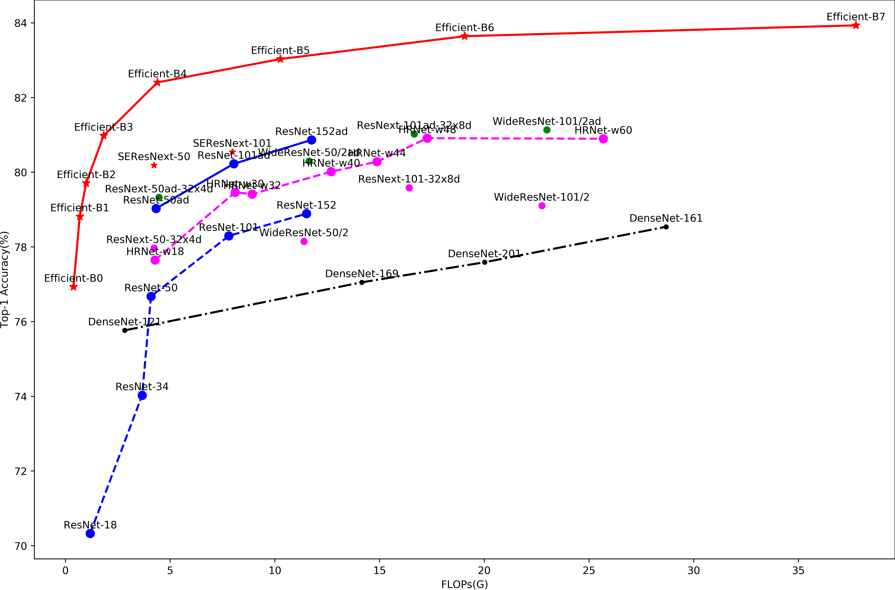
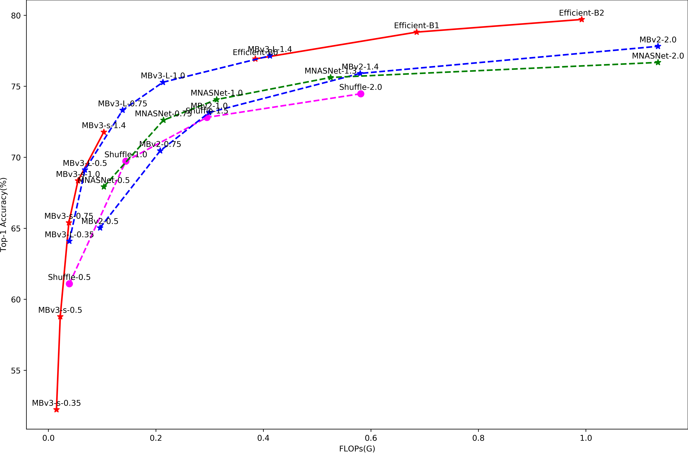

Benckmark
==========

.. toctree::
   :maxdepth: 2

Benckmark on ImageNet is given here: `Imagenet Model Zoo <https://confluence.sensetime.com/display/VIBT/ImageNet+Model+Zoo>`_

Some results are shown in:

Heavy Models
-------------

Tiny Models
------------

