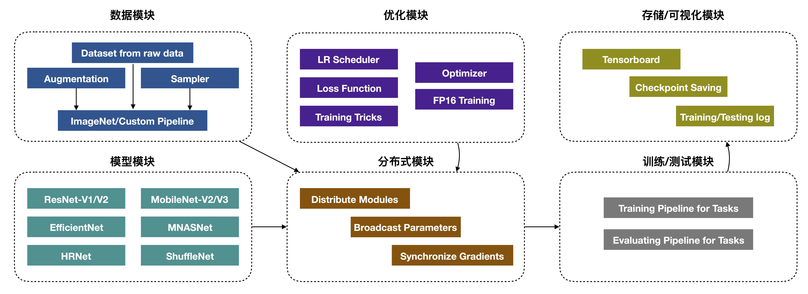

.. prototype documentation master file, created by
   sphinx-quickstart on Thu Jun 11 12:28:21 2020.
   You can adapt this file completely to your liking, but it should at least
   contain the root `toctree` directive.

Welcome to Prototype's documentation!
=====================================

Prototype是一个基于分布式训练的通用图像分类框架，目的提供学术研究和产品化支持。

 * 在基础研究方面，提供ResNet、MobileNet、EfficientNet、RegNet等SOTA网络结构，支持EMA、Cutmix、Mixup等训练策略。
 * 在训练能力方面，提供基于Linklink的FP16训练、LMS大模型支持和LARS优化等。
 * 在下游任务支持方面，提供SOTA精度的ImageNet预训练模型，可以被检测、分割、关键点等任务使用。同时基于Spring工具链，提供分类模型量化压缩、剪枝、蒸馏、模型结构搜索等。

.. toctree::
   :maxdepth: 2
   :caption: Contents:

   install/index
   tutorial/index
   configs/index
   advance/index
   api/index
   faq/index
   benckmark/index

Indices and tables
==================

* :ref:`genindex`
* :ref:`modindex`
* :ref:`search`
